### Windows 7 English

#### Network Discovery

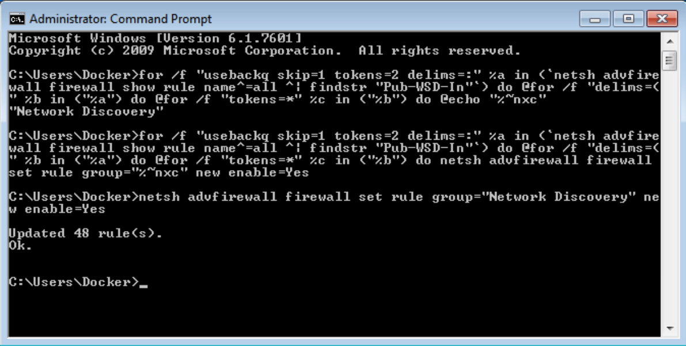

#### File And Printer Sharing

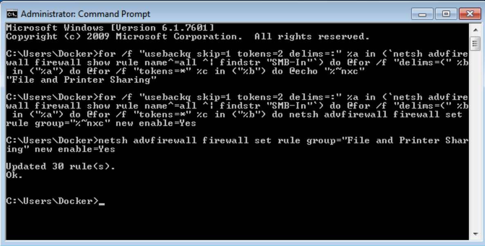

#### Remote Desktop

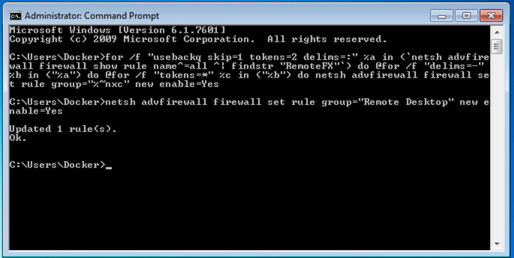


### Windows 7 Chinese


#### Network Discovery

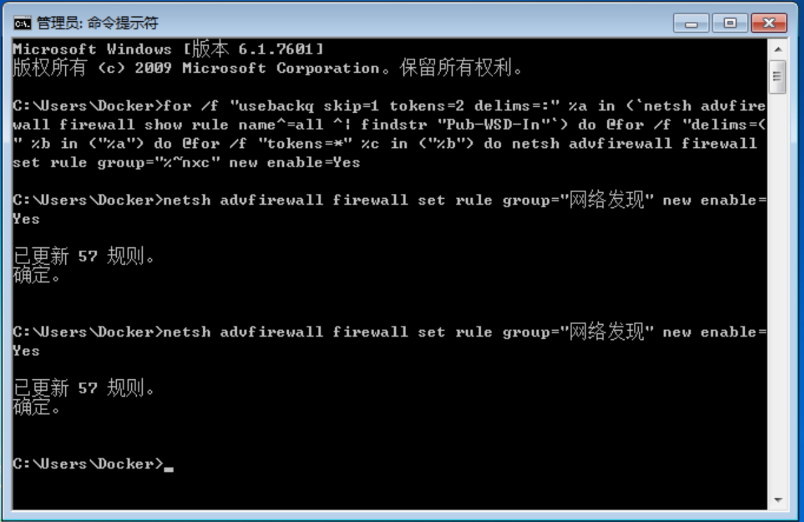

#### File And Printer Sharing

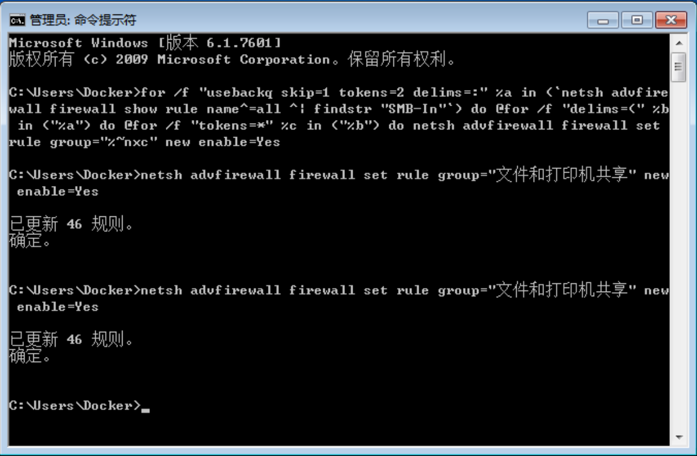

#### Remote Desktop

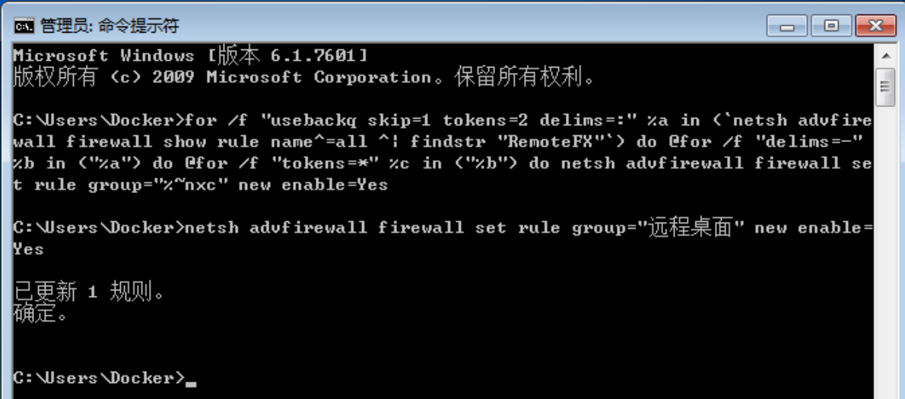

- For unknown reason it seems to able to find 1 more result.
- Actually it isn't matter too much.


### Windows 2008 English

#### Network Discovery

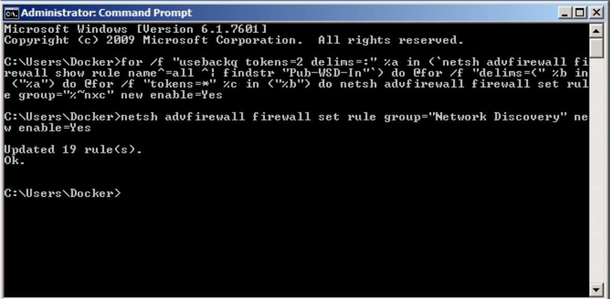

#### File And Printer Sharing

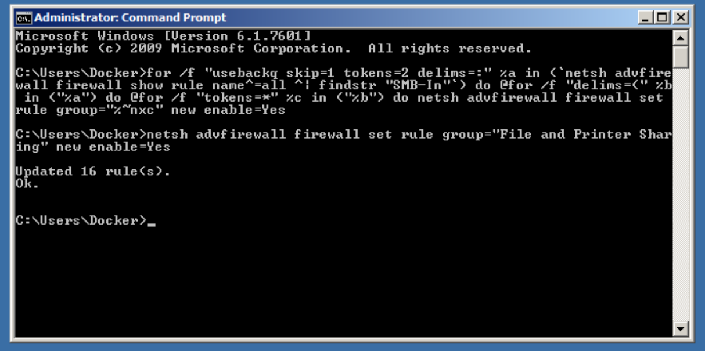

#### Remote Desktop

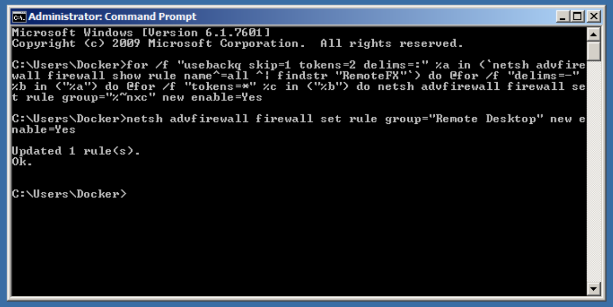

### Windows 2008 Chinese

- **haven't found Chinese ISO**

### Windows vista English

#### Network Discovery

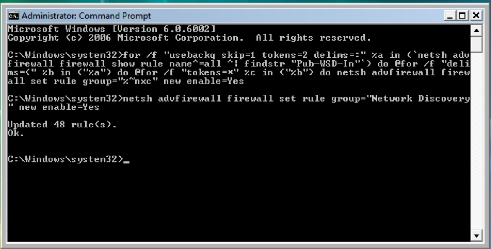

#### File And Printer Sharing

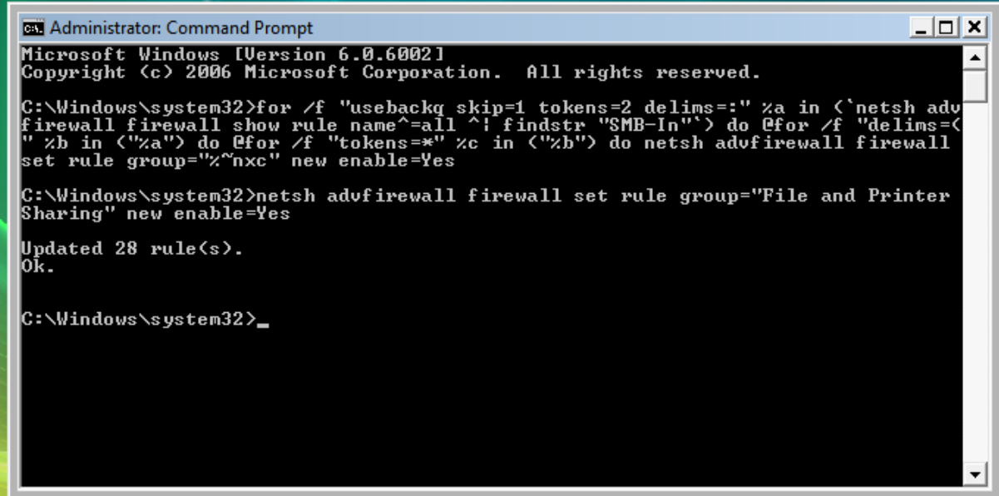

#### Remote Desktop

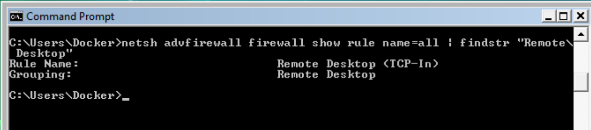
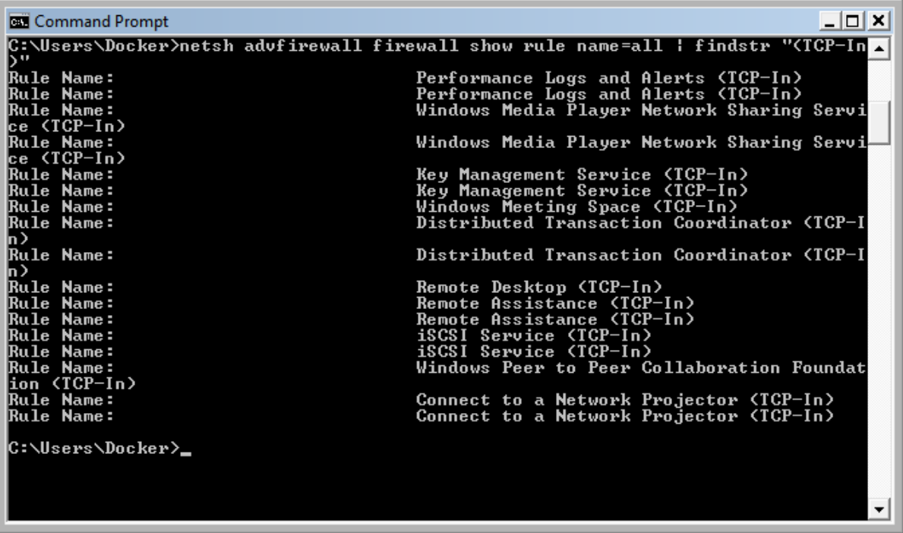
- As the result of searching "Remote Desktop" and there is many results when searching "(TCP-In)", I haven't found a better way to get "Remote Desktop" string.


### Windows vista Chinese

- **haven't found Chinese ISO**


## ISO used to test

### English

```yaml
environment:
  VERSION: "win7"
  VERSION: "2008"
  VERSION: "vista"
```

### Chinese

[Windows 7 With SP1 64位简体中文旗舰版.iso](https://file.cnxiaobai.com/Windows/%E7%B3%BB%E7%BB%9F%E5%AE%89%E8%A3%85%E5%8C%85/Windows%207/Windows%207%20With%20SP1%2064%E4%BD%8D%E7%AE%80%E4%BD%93%E4%B8%AD%E6%96%87%E6%97%97%E8%88%B0%E7%89%88.iso)

You can browse from [Windows 7](https://file.cnxiaobai.com/Windows/%E7%B3%BB%E7%BB%9F%E5%AE%89%E8%A3%85%E5%8C%85/Windows%207/)

And make sure your XML file has changed to **zh-CN** locale. You can use the script in [\[Question\]: 修改windos密码 和 使用自定义的镜像无法使用rdp远程](https://github.com/dockur/windows/issues/490)

You can found all commands in [commands.txt](commands.txt)
